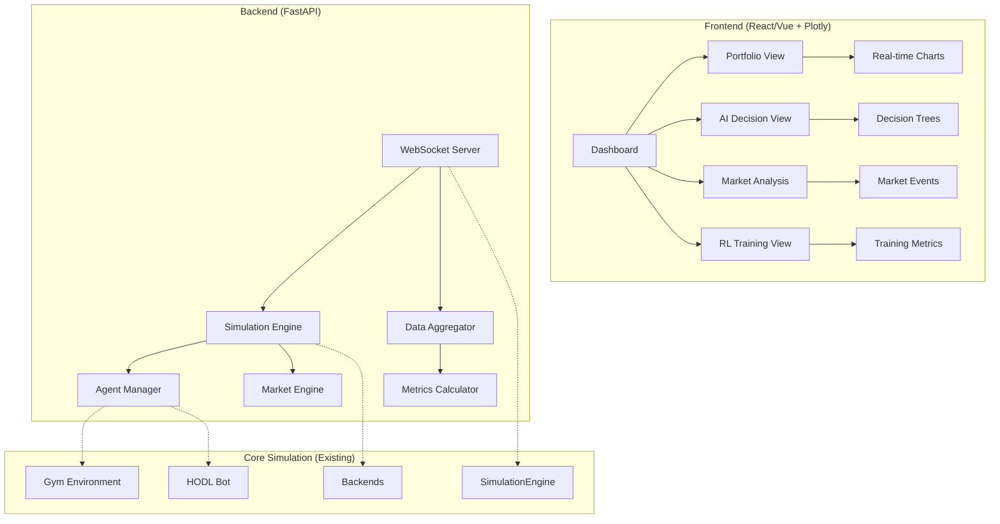
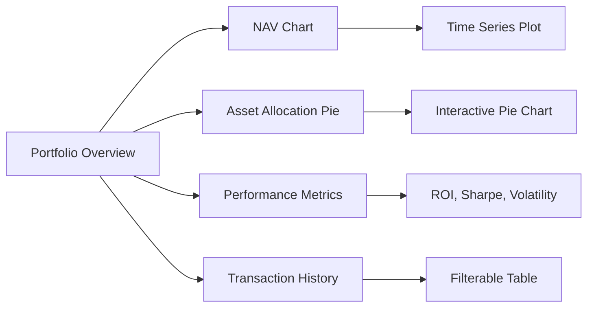
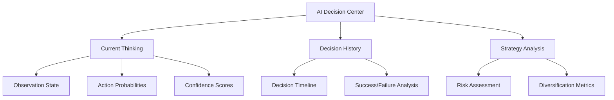
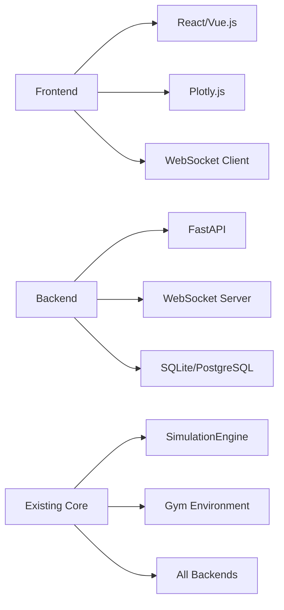

# Agent Tycoon Visualization & Observability Enhancement Plan

## Executive Summary
Transform Agent Tycoon from a text-based simulation into a comprehensive visualization platform that maintains simulation integrity while providing deep insights into AI decision-making, financial performance, and market dynamics.

## Technical Recommendation: Web Application
**Why Web App over Desktop:**
- **More Data Display**: Responsive layouts, multiple tabs/panels, infinite scroll for historical data
- **Easier Development**: Faster iteration with HTML/CSS/JS, extensive charting libraries
- **Better Sharing**: Easy to share results, export reports, run on any device
- **RL Integration**: Better support for real-time streaming data and WebSocket connections
- **Extensibility**: Easier to add new features, integrate with external APIs

## Architecture Overview

## Phase 1: Core Visualization Infrastructure

### 1.1 Backend Enhancement
- **WebSocket Server**: Real-time data streaming to frontend
- **Data Collection Layer**: Capture all simulation events, decisions, and state changes
- **API Endpoints**: RESTful APIs for historical data, configuration, and control
- **Event System**: Publish-subscribe pattern for real-time updates

### 1.2 Frontend Foundation
- **React/Vue Application**: Modern web framework with component architecture
- **Chart Library Integration**: Plotly.js for interactive, professional charts
- **Real-time Updates**: WebSocket client for live data streaming
- **Responsive Layout**: Multi-panel dashboard that adapts to screen size

## Phase 2: Financial Performance Visualization

### 2.1 Portfolio Dashboard

**Features:**
- **Real-time NAV Chart**: Line chart showing portfolio value over time
- **Asset Allocation Visualization**: Interactive pie/donut charts showing current allocation
- **Performance Metrics Panel**: ROI, Sharpe ratio, volatility, max drawdown
- **Transaction History**: Searchable, filterable table of all trades
- **Comparison Charts**: Agent performance vs HODL bot vs benchmarks

### 2.2 Individual Asset Tracking
- **Price Charts**: Candlestick/line charts for each stock/bond
- **Holdings Timeline**: When assets were bought/sold and quantities
- **Profit/Loss Attribution**: Which assets contributed most to performance

## Phase 3: AI Decision Intelligence

### 3.1 Decision Visualization

**Features:**
- **Decision Tree Visualization**: Show how AI weighs different factors
- **Confidence Heatmaps**: Visual representation of AI certainty in decisions
- **Strategy Evolution**: How AI strategy changes over time
- **Feature Importance**: Which market signals influence decisions most

### 3.2 RL Training Insights
- **Training Progress**: Loss curves, reward progression, exploration vs exploitation
- **Policy Visualization**: How the policy network evolves during training
- **Action Distribution**: Histogram of actions taken over time
- **Learning Efficiency**: Sample efficiency, convergence metrics

## Phase 4: Market Dynamics & Events

### 4.1 Market Visualization
- **Market State Dashboard**: Current volatility, trends, correlations
- **Shock Event Timeline**: Visual representation of market shocks and their impacts
- **Correlation Matrix**: Heatmap showing asset correlations over time
- **Volatility Surface**: 3D visualization of market volatility patterns

### 4.2 Event Impact Analysis
- **Before/After Comparisons**: How shocks affect portfolio performance
- **Recovery Analysis**: How quickly markets and portfolios recover
- **Shock Sensitivity**: Which assets are most affected by different shock types

## Phase 5: Advanced Analytics & Comparison

### 5.1 Multi-Agent Comparison
- **Tournament Mode**: Run multiple AI agents simultaneously
- **Performance Leaderboard**: Ranking agents by various metrics
- **Strategy Clustering**: Group agents by similar behavior patterns
- **Meta-Analysis**: What strategies work best in different market conditions

### 5.2 Scenario Analysis
- **What-If Scenarios**: Replay simulations with different parameters
- **Stress Testing**: How agents perform under extreme market conditions
- **Sensitivity Analysis**: How small changes affect outcomes

## Implementation Details

### Technology Stack

### Data Flow Architecture
1. **Simulation Events** → **Event Collector** → **WebSocket** → **Frontend**
2. **Historical Data** → **Database** → **REST API** → **Frontend**
3. **User Controls** → **Frontend** → **WebSocket** → **Simulation Controller**

### Key Enhancements to Existing Code
- **Event Logging**: Add comprehensive logging to `SimulationEngine`
- **State Serialization**: Make all state objects JSON-serializable
- **WebSocket Integration**: Add real-time communication layer
- **Configuration API**: Web interface for modifying simulation parameters

## Benefits of This Approach

1. **Maintains Simulation Integrity**: Core simulation logic remains unchanged
2. **Rich Observability**: See everything happening in real-time
3. **AI Transparency**: Understand how and why AI makes decisions
4. **Performance Analysis**: Deep insights into ROI and risk metrics
5. **Research Capabilities**: Compare strategies, analyze market dynamics
6. **Educational Value**: Learn about finance and AI through visualization
7. **Extensible**: Easy to add new features and visualizations

## Success Metrics
- **Visualization Coverage**: 100% of simulation state visible
- **Real-time Performance**: <100ms latency for live updates
- **Decision Transparency**: Clear understanding of AI reasoning
- **Performance Insights**: Comprehensive ROI and risk analysis
- **User Experience**: Intuitive, responsive interface

## Implementation Priority

### High Priority (Core Functionality)
1. **WebSocket Backend**: Real-time data streaming infrastructure
2. **Basic Dashboard**: Portfolio overview with NAV chart and allocation pie chart
3. **Transaction History**: Table showing all trades and decisions
4. **AI Decision Display**: Current agent state and recent decisions

### Medium Priority (Enhanced Analytics)
1. **Performance Metrics**: Sharpe ratio, volatility, drawdown calculations
2. **Market Event Visualization**: Shock events and their impacts
3. **HODL Comparison**: Side-by-side performance comparison
4. **Asset Price Charts**: Individual asset performance tracking

### Lower Priority (Advanced Features)
1. **Multi-Agent Tournaments**: Compare multiple AI strategies
2. **3D Visualizations**: Advanced market correlation surfaces
3. **Export Capabilities**: PDF reports and data export
4. **Configuration Interface**: Web-based parameter tuning

This plan transforms Agent Tycoon into a powerful, observable simulation platform while preserving its sophisticated financial modeling and AI capabilities. The web-based approach provides maximum flexibility for data visualization and future enhancements.