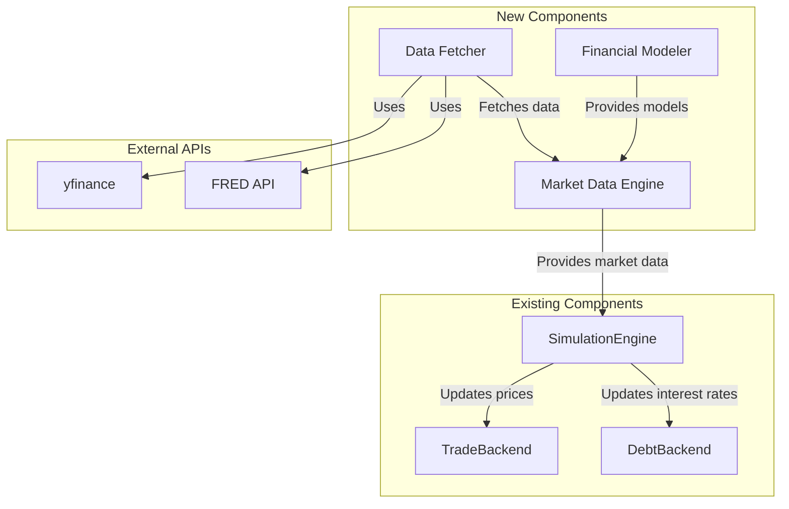
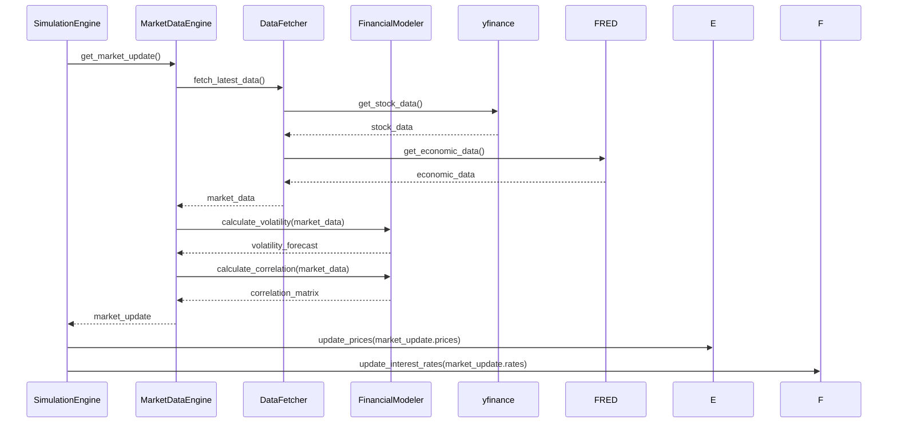

# Implementation Plan: Realistic Financial Market Simulation

This document outlines the plan to integrate a realistic financial market simulation into the Agent Tycoon platform.

### 1. Current Architecture Analysis

The existing architecture is a solid foundation, but it relies on simplified, random-based models for market dynamics. Here’s a summary of the key components and their current roles:

*   **`backends.py`**: This file contains the core logic for handling different asset types:
    *   `TradeBackend`: Manages stock trading. Prices are loaded from a configuration file and only change during random "shock" events.
    *   `ProjectBackend`: Handles investments in projects with probabilistic outcomes. This is largely disconnected from the market simulation.
    *   `DebtBackend`: Manages bond trading with a simplistic interest rate model.
*   **`engine.py`**: The `SimulationEngine` orchestrates the simulation, advancing it step-by-step. It includes a basic "shock" mechanism that randomly triggers market volatility or interest rate changes. This is the primary area that will be replaced.
*   **`models.py`**: Defines the data structures for the simulation using Pydantic. This will need to be extended to support the new market data.
*   **`config_loader.py`**: Loads the initial simulation state from JSON files. This will be used to set the initial conditions, but the simulation will then be driven by real market data.
*   **`requirements.txt`**: Lists the current dependencies. It will need to be updated with new libraries for data fetching and analysis.

### 2. Proposed Architecture for Realistic Financial Simulation

To achieve a more realistic simulation, we will introduce a new, modular component: the **Market Data Engine**. This engine will be responsible for fetching, processing, and providing real-world market data to the simulation.

Here is a diagram illustrating the proposed architecture:

### 3. Detailed Implementation Plan

Here is a breakdown of the new components and the necessary modifications to the existing code:

#### **Phase 1: Market Data Engine**

1.  **Create a `market_data` directory.** This will house all the new components related to market data.
2.  **Implement the `DataFetcher` (`market_data/fetcher.py`):**
    *   This module will be responsible for fetching data from external APIs.
    *   It will have methods to get historical stock data from `yfinance`.
    *   It will also have methods to fetch economic data (e.g., interest rates, inflation) from the FRED API.
3.  **Implement the `FinancialModeler` (`market_data/modeler.py`):**
    *   This module will contain the financial models.
    *   It will include a GARCH model for volatility forecasting.
    *   It will also have a method to calculate a correlation matrix for stock returns.
4.  **Implement the `MarketDataEngine` (`market_data/engine.py`):**
    *   This will be the central hub for market data.
    *   It will initialize the `DataFetcher` and `FinancialModeler`.
    *   It will have a `get_market_update` method that provides the `SimulationEngine` with new prices, interest rates, and other relevant data for each tick.

#### **Phase 2: Integration with the Simulation Engine**

1.  **Modify `engine.py`:**
    *   The `SimulationEngine` will be initialized with an instance of the `MarketDataEngine`.
    *   The `trigger_shock` method will be replaced with a call to `market_data_engine.get_market_update()`.
    *   The `_apply_market_volatility` and `_apply_rate_shock` methods will be removed.
2.  **Modify `backends.py`:**
    *   The `TradeBackend`'s `update_prices` method will be called by the `SimulationEngine` with the new prices from the `MarketDataEngine`.
    *   The `DebtBackend` will be updated to use the real interest rates from the `MarketDataEngine`, replacing the simple shock mechanism.
3.  **Update `requirements.txt`:**
    *   Add the following dependencies:
        *   `yfinance`
        *   `pandas`
        *   `statsmodels`
        *   `fredapi`

### 4. Data Flow

Here is a diagram illustrating the data flow in the new architecture:

### 5. Potential Challenges and Considerations

*   **API Rate Limits:** Both `yfinance` and the FRED API have rate limits. The `DataFetcher` should include caching and be mindful of the number of requests it makes.
*   **Data Cleaning:** Real-world financial data can be noisy and contain errors. The `DataFetcher` should include logic to handle missing data and outliers.
*   **Model Complexity:** Financial models like GARCH can be computationally intensive. The implementation should be optimized for performance.
*   **Backtesting:** Once the new system is in place, it will be important to backtest it against historical data to ensure it behaves as expected.

### 6. Phased Implementation Roadmap

We recommend the following phased approach to implementation:

*   **Milestone 1: Data Fetching and Storage**
    *   Implement the `DataFetcher`.
    *   Write scripts to download and store historical data.
    *   Update `requirements.txt`.
*   **Milestone 2: Financial Models**
    *   Implement the `FinancialModeler` with the GARCH and correlation models.
    *   Write unit tests to validate the models.
*   **Milestone 3: Market Data Engine**
    *   Implement the `MarketDataEngine` to orchestrate the data flow.
*   **Milestone 4: Integration**
    *   Integrate the `MarketDataEngine` with the `SimulationEngine`.
    *   Refactor the `TradeBackend` and `DebtBackend` to use the new data.
*   **Milestone 5: Testing and Validation**
    *   Perform end-to-end testing of the new system.
    *   Backtest the simulation against historical data.